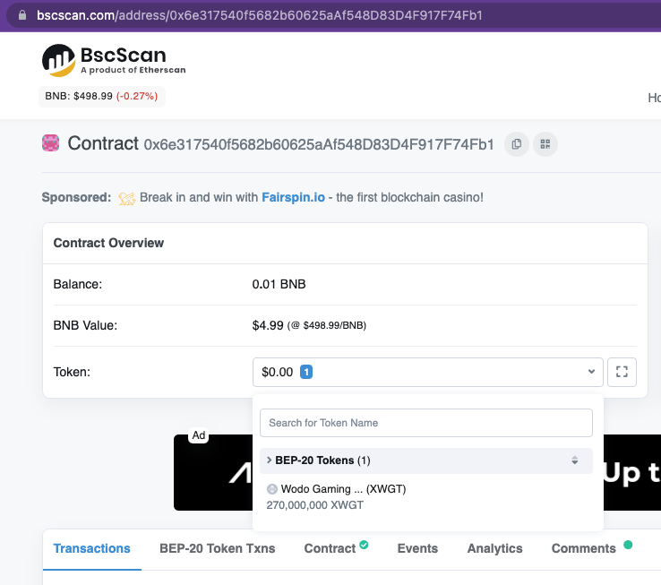
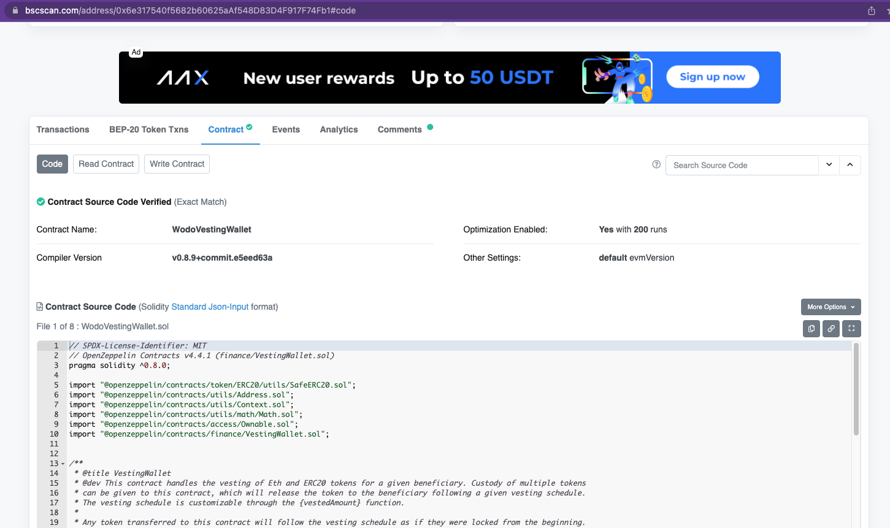
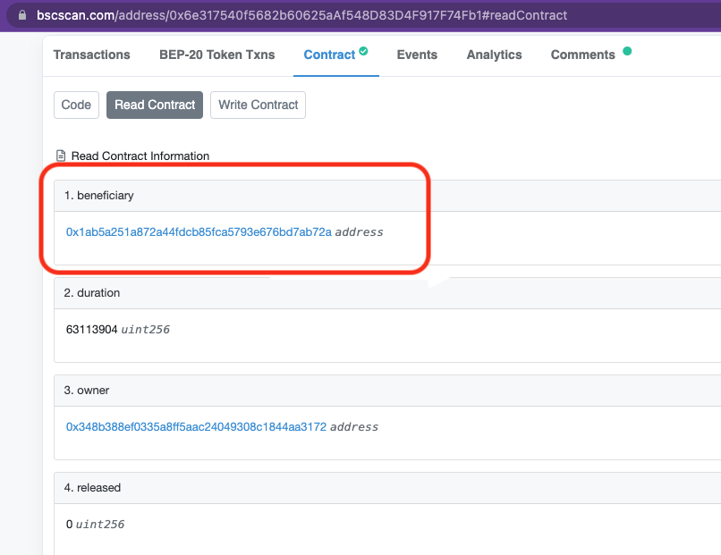
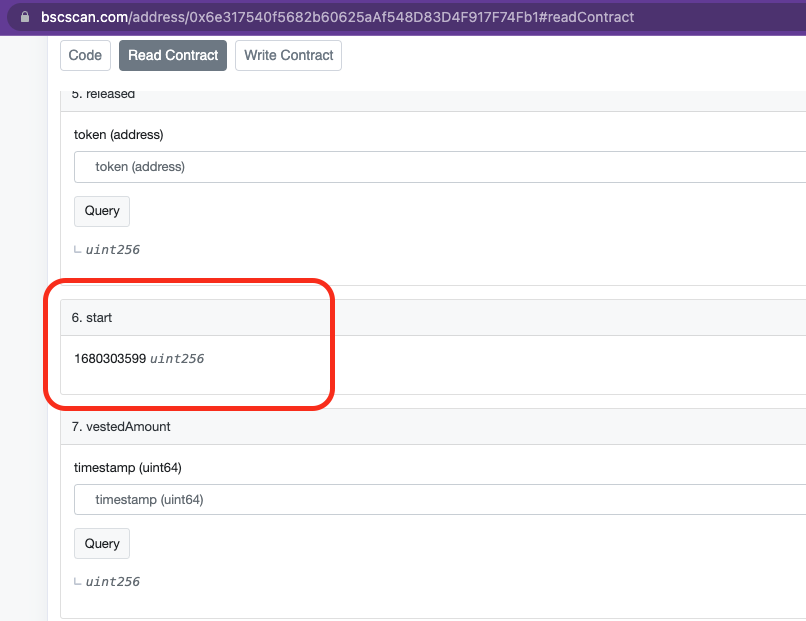
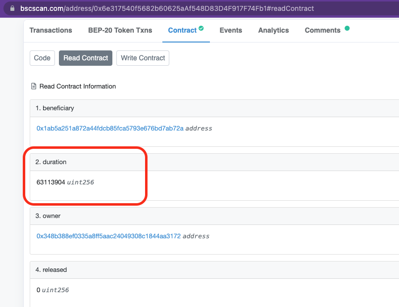
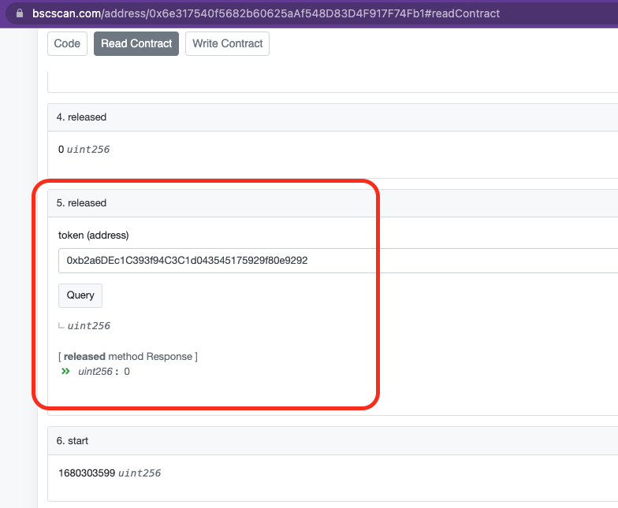

<p align="center">
  <a href="https://wodo.io/" target="blank"></a>
</p>

<div align="center">
<h2> Wodo Gaming Platform Smart Contracts </h2>
</div>

<div align="center">
  <h4>
    <a href="https://wodo.io/">
      Website
    </a>
    <span> | </span>
    <a href="#">
      Product Docs
    </a>
    <span> | </span>
    <a href="#">
      Architecture Docs
    </a>
    <span> | </span>
    <!-- <a href="#"> -->
    <!--   CLI -->
    <!-- </a> -->
    <!-- <span> | </span> -->
    <a href="#/CONTRIBUTING.md">
      Contributing
    </a>
    <span> | </span>
    <a href="https://twitter.com/wodoio">
      Twitter
    </a>
    <span> | </span>
    <a href="https://t.me/wodoio">
      Telegram
    </a>
    <span> | </span>
    <a href="https://discord.gg/fbyns8Egpb">
      Discourd
    </a>
    <span> | </span>
    <a href="https://wodoio.medium.com/">
      Medium
    </a>
    <span> | </span>
    <a href="https://www.reddit.com/r/wodoio">
      Reddit
    </a>
  </h4>
</div>

<h3> Table of Contents </h3> 

- [About](#about)
- [Contracts](#contracts)
  - [Wodo Gaming Token Contract - XWGT](#wodo-gaming-token-contract---xwgt)
  - [Vesting Wallet Contract - Token Distribution Locks](#vesting-wallet-contract---token-distribution-locks)
- [Deployed Contracts - BSC Mainnet](#deployed-contracts---bsc-mainnet)
  - [XWGT Token](#xwgt-token)
  - [Company Reserves Locker Contract](#company-reserves-locker-contract)
  - [Play to Earn Locker Contract](#play-to-earn-locker-contract)
  - [Dev Team Locker Contract](#dev-team-locker-contract)
- [Vesting Wallet Contract Validation](#vesting-wallet-contract-validation)
- [Audits](#audits)
- [Contract Deployment Process](#contract-deployment-process)
- [Useful Commands](#useful-commands)
----


# About

This module contains smart contracts implementation of the wodo gaming platform. The smart contracts are developed upon https://openzeppelin.com/ standards - version 4.4.1.

Wodo gaming contracts are located in "contracts/wodo" folder.


# Contracts

As of today, we provide 2 main contracts for wodo gaming token (XWGT) and lock some ditributes shares in our <a href="https://docs.wodo.io/wodo-gaming/tokenomics/wodo-gaming-token"> tokenomics plans</a>. 

## Wodo Gaming Token Contract - XWGT

WodoGamingToken contract - contracts/wodo/WodoGamingToken.sol - is a stanrad ERC20 built upon openzeppelin contracts. It is created with 1B fixed total supply and not possible to mint(generate) additional tokens once the contracts is deployed. It offers token burning , pausing and account blocking functionalties to adress business critical aspects. 

Multiple roles are defined, each allowed to perform different sets of actions described above. Also contract owner is assigned to admin role so that the owner can manage role assigments using the functions available in the contract.

```code
    bytes32 public constant PAUSER_ROLE = keccak256("PAUSER_ROLE");
    bytes32 public constant BLOCKER_ROLE = keccak256("BLOCKER_ROLE");
    bytes32 public constant BURNER_ROLE = keccak256("BURNER_ROLE");
```

The initial role assigments are done in the constractor of the contract. The constructor is executed only once during contract deployment so that the owner is granted to admin role

```code
    constructor() ERC20("Wodo Gaming Token", "XWGT") {
        _grantRole(DEFAULT_ADMIN_ROLE, msg.sender); // see AccessControl.sol for this one
        _grantRole(PAUSER_ROLE, msg.sender);
        _grantRole(BLOCKER_ROLE, msg.sender);
        _grantRole(BURNER_ROLE, msg.sender);
        _mint(msg.sender, 1000000000 * 10 ** decimals()); // mint a fixed total supply of 1 billion tokens. The total supply can not be extended
    }
```

## Vesting Wallet Contract - Token Distribution Locks

This contract - contracts/wodo/WodoVestingWallet.sol -  handles the vesting of Eth and ERC20 tokens for a given beneficiary. Custody of multiple tokens can be given to the contract, which will release the token to the beneficiary following a given vesting schedule.

```code
    constructor(
        address beneficiaryAddress,
        uint64 startTimestamp,
        uint64 durationSeconds
    )
```
startTimestamp is considered as "cliff period". Before the start time no tokens are released for vesting. The value od the start time refers to a future date. Token will be locked on the contracts till the start time. Once the start time is reached, tokens will be released based on durationSeconds formula.

If 10M tokens are locked on the contracts with start time: 6 momths and duration 1 year, the vesting formula runs as below:

- No token release till the start time which is 6 months later than the contract deployment time.
- Once cliff period ends, tokens will be eligible for unlocking and releasing based on 1 year duration, which is 10M/365 = 27397 tokens will be released daily
- Actual transfer occurs to the given beneficiary account when the contract owner calls the release(token) method
  

Any token transferred to this contract will follow the vesting schedule as if they were locked from the beginning.Consequently, if the vesting has already started, any amount of tokens sent to this contract will (at least partly) be immediately releasable.

# Deployed Contracts - BSC Mainnet

The contracts are deployed to BCS main network. you can find the deatils and sourcecode of the contracts in the related bsc mainnet links

## XWGT Token
<p>
- XWGT Token:

  * Main holder account: 0x348b388Ef0335a8ff5AAc24049308c1844AA3172
  * Token Address: 0xb2a6DEc1C393f94C3C1d043545175929f80e9292
  * Token url: https://bscscan.com/address/0xb2a6DEc1C393f94C3C1d043545175929f80e9292
  
</p>

## Company Reserves Locker Contract

<p>
- Company Reserves Account: 270M  XWGT locked in the vesting wallet till 01 April, 2023, will be released over 2 years period after the locking is revoked
  
  * Address: 0x1Ab5a251a872A44FdcB85FCa5793E676bD7aB72A
  * url: https://bscscan.com/address/0x1Ab5a251a872A44FdcB85FCa5793E676bD7aB72A

  - Company Reserves Vesting Wellet: 
    * address: 0x6e317540f5682b60625aAf548D83D4F917F74Fb1
    * url: https://bscscan.com/address/0x6e317540f5682b60625aAf548D83D4F917F74Fb1
    * vestingWallet arguments: address:0x1Ab5a251a872A44FdcB85FCa5793E676bD7aB72A , start:1680303599 , duration:63113904
</p>

## Play to Earn Locker Contract

<p>
- Play to Earn  Account: 200M  XWGT locked in the vesting wallet till 01 August, 2022, will be released over 10 years period after the locking is revoked
    
  * Address:0x06FFB27743A561f22DAa9f87999A53610038DA79
  * url: https://bscscan.com/address/0x06FFB27743A561f22DAa9f87999A53610038DA79

  - Play to Earn Vesting Wallet:
    * address: 0xd8C9e7202a7B94f7F87383f368d51fee7Aa05c25
    * url: https://bscscan.com/address/0xd8C9e7202a7B94f7F87383f368d51fee7Aa05c25
    * vestingWallet arguments: address:0x06FFB27743A561f22DAa9f87999A53610038DA79 , start:1659308399 , duration:315569520

</p>

## Dev Team Locker Contract

<p>
- Dev Team  Account: 150M  XWGT locked in the vesting wallet till 01 February, 2023, will be released over 2 years period after the locking is revoked
  
  * Address:0xD08826eAb186689dDc939571640a46fE01478B5C
  * url: https://bscscan.com/address/0xD08826eAb186689dDc939571640a46fE01478B5C

  - Dev Team Vesting Wallet:
    * address: 0x440789bc77B135DB246C434BDf8B3693b85F3CC2
    * url: https://bscscan.com/address/0x440789bc77B135DB246C434BDf8B3693b85F3CC2
    * vestingWallet arguments: address:0xD08826eAb186689dDc939571640a46fE01478B5C , start:1675209599 , duration:63113904
</p>

# Vesting Wallet Contract Validation

Each vesting vallet contratct deployed to the BSC mainnet exposed public methods to retrieve and validate vesting start time(in seconds) - aka end of token locking -, and duration(in seconds) that determines the token releasing ratio over the course of given duration once the token lock is revoked.Here are the steps to validate company reserves vesting contract as other vesting contract can be validated in the same way:

- Validate that 270M XWGT token are stored in the vesting conttract. Once the locking ends, 270M XWGTs in costady will be released to the beneficary account gradaally based on the duration setting. Go to the vesting contract link https://bscscan.com/address/0x6e317540f5682b60625aAf548D83D4F917F74Fb1#readContract and see 270M XWGT as mentioned on the secreentshot below

<p>

</p>

- Validate that source code of the deployed vesting vallet contracts is the same as the one in the git repository: https://raw.githubusercontent.com/wodo-platform/wp-smart-contracts/main/contracts/wodo/WodoVestingWallet.sol . See the screenshot below

<p>

</p>

- Validate the beneficary. Go to the read contract tab as shown on the screenshot below and validate that the beneficary account is the same as the one mentioned on the page https://docs.wodo.io/wodo-gaming/tokenomics/wodo-gaming-token
  
<p>

</p>

- Validate the start date when token locking ends and vesting starts. It is exposed as started date(in seconds) on the read contracts tab. You can convert seconds to date on <a href="https://www.unixtimestamp.com/index.php">this web page </a>

<p>

</p>

- Validate the duration that determines the timespan the locked tokes will be released gradually. It is exposed as duration(in seconds) on the read contracts tab. You can convert seconds to date on <a href="https://www.unixtimestamp.com/index.php">this web page </a>

<p>

</p>

- Validate the total released XWGT tokens so far on the read contracts tab. It is exposed via "released" function. Fill "0xb2a6DEc1C393f94C3C1d043545175929f80e9292" as XWGT token address. The retirn value must be zero since the started date has not passed yet. You can refresh the page to retrieve the released value.

<p>

</p>


# Audits

We plan to manage our auiditing process with different audit companies Expert teams will run a full audit regarding full coarse of security aspects as well as source code integrity to make sure that smart contracts are deployed properly to the BCS mainnet and functions as explained in our documentation.

We will share our audit reports.


# Contract Deployment Process

Simple deployment scripts are implemented to run deployment and source publishing on BCS test and main networks

-- deploy contracts ---

WogoGamingToken

```shell
$ npx hardhat run --network mainnet scripts/deploy_token.js

WGT deployed to: 0xb2a6DEc1C393f94C3C1d043545175929f80e9292

```

Verify contract by uploading the source codes

```shell
$ npx hardhat verify --network mainnet --contract contracts/wodo/WodoGamingToken.sol:WodoGamingToken 0xb2a6DEc1C393f94C3C1d043545175929f80e9292
```

Vesting Wallet

```shell
$ npx hardhat run --network testnet scripts/deploy_vasting_wallet.js 
vestingWallet arguments: address:0x2Ada54c4deEc63a5C629122C673fEcBE38b67fB8 , start:1641118122 , duration:86400
VestingWallet deployed to: 0x59aA28101fe6B8b09755e2320c36741e91Faf3cD
```
Now update parameters address, start and duration with the values printed above in scripts/vesting_wallet_constructor_args.js file

Verify contract by uploading the source codes


```shell
$ npx hardhat verify --network testnet --contract contracts/wodo/WodoVestingWallet.sol:WodoVestingWallet --constructor-args scripts/vesting_wallet_constructor_args.js 0x59aA28101fe6B8b09755e2320c36741e91Faf3cD
```


# Useful Commands

-- start local block chain in new bash console ---

```shell
$ npx hardhat node 
```

-- run tests in the project root-- 

```shell
$ npx hardhat test 
```

-- connect local chain to run some live commands ---

```shell
$ npx hardhat console --network localhost
```
and run some commands in the sessions

const WGT = await ethers.getContractFactory('WodoGamingToken');
const wgt = await WGT.attach('0x5FbDB2315678afecb367f032d93F642f64180aa3')


-- connect local chain to run some js files ---

```shell
$ npx hardhat run --network localhost ./scripts/index.js
```
